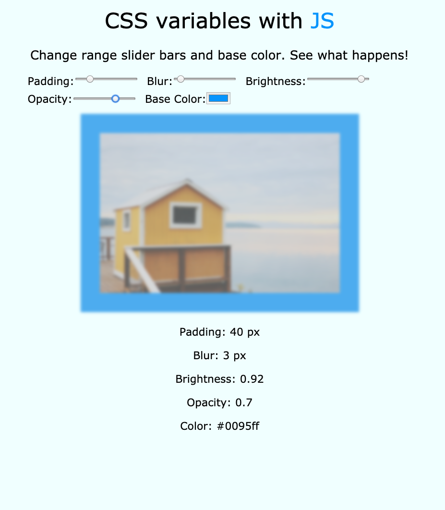

# 03.CSS Variables

#### _CSS Variables by JavaScript30 10/03/19_

## Description
This is CSS Variables application, 3rd application out of 30 by 30 day Vanilla JavaScript Coding Challenge by Wes Bos.<br>
Please check the challenge from [JavaScript30](http://wesbos.com/javascript30/).




## About this Application:
- `padding` slider range is 0px to 200px.
- `blur` slider range is 0px to 50px.
- `brightness` slider range is 0 to 1 (darkest to brightest).
- `opacity` slider range is 0 to 1.
- User can choose a `color` for `padding`. HEX color code will be shown.


## Setup/Installation Requirements

1. Clone this repo:
```
$ git clone https://github.com/misakimichy/js30-03-css-variables.git
```

2. Navigate to the top level of the cloned directory.

3. Open `index.html` with your preferred web browser.

## Known Bugs
* No known bugs at this time.

## Support and contact details
 I welcome any feedbacks and comments: misaki.koonce@gmail.com

## Technologies Used
_Git, GitHub, HTML, CSS, Vanilla JavaScript

## License
Copyright © 2019 under the MIT License